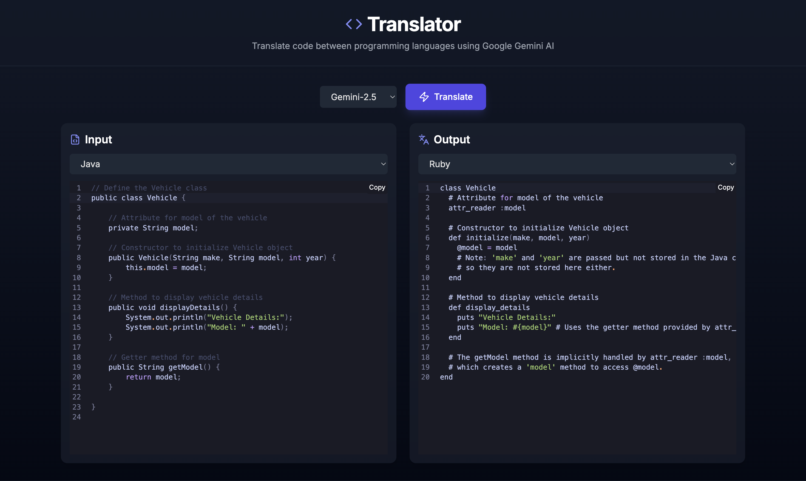

# AI Code Translator

AI Code Translator is a web application that leverages Google's Gemini API to translate code snippets from one programming language to another. It also supports translating natural language to code and vice-versa.



## Features

*   Translate code between a wide variety of programming languages.
*   Convert natural language descriptions into executable code.
*   Explain code in plain English.
*   User-friendly interface with side-by-side input and output.
*   Support for different Gemini models.
*   Copies translated code to clipboard automatically.

## Live Demo

**[Access the live application here](https://code-translator-inky.vercel.app/)**

## Running Locally

To run this application on your local machine, follow these steps:

**1. Clone Repo**

```bash
git clone https://github.com/AnmolDotX/CodeTranslator.git
cd CodeTranslator
```

**2. Install Dependencies**

Make sure you have Node.js and npm (or yarn) installed.

```bash
npm install
```

**3. API Key Setup**

This application requires a Google Gemini API key to function.

*   You will need to generate an API key from [Google AI Studio](https://aistudio.google.com/app/apikey).


**4. Run App**

Once dependencies are installed, you can start the development server:

```bash
npm run dev
# or
# yarn dev
```

The application will typically be available at `http://localhost:3000`.

## How It Works

The application takes your input code (or natural language), the selected input and output languages. This information is sent to a backend API route within the Next.js application. The backend then securely calls the Google Gemini API to perform the translation. The translated code is streamed back to the frontend and displayed in real-time.

## Contact

If you have any questions, feedback, or would like to contribute, feel free to reach out:

*   **Anmol (Author)**: [Twitter @AnmolDotX](https://twitter.com/AnmolDotX) | [GitHub @AnmolDotX](https://github.com/AnmolDotX)

---

Built with Next.js, TypeScript, Tailwind CSS, and the Google Gemini API.
